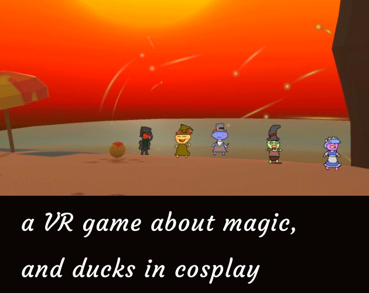
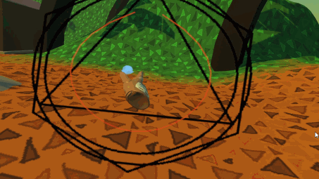

    

This is my submission to the "I Can't Draw But Want To Make A Game (Again)" game jam. Draw sigils and cast spells in VR to help some cosplaying ducks have a summer festival!

I'm once again posting my spaghetti code, there's some neat stuff in here. [You can find the game here (itch.io)](
https://request.itch.io/a-vr-game-about-magic-and-ducks-in-cosplay), it's free to play, and runs on any SteamVR capable headset (PCVR).

You're free to do whatever with this code, but if you do use it, it'd be real cool of you to link back to this page or the itch.io page (or both). Thanks o/

## About

In this game, you play as a magician who's come to an island inhabitted by cosplaying ducks. You'll have to draw magic sigils, and cast magic in order to help them prepare for the upcoming festival!

There's 5 lovely ducks on the island, each with their own unique quirks and story. Total play time is roughly 30-60 minutes, depending on your reading speed.

    

There were 2 main systems that I wanted to reproduce as part of this game jam:

The first was the spell sigil drawing system. When I was a kid, I played a DS game called Lost Magic. Lost Magic is a realtime strategy game where you have to draw spell sigils on the touchpad, and the game uses that to detect which spell the player meant to cast.
You can see an example of that in the above gif.

The second was the sprite-based characters, from the Danganronpa series. In Danganronpa, there are sections where the player can free-roam in 3d space, and interact with characters rendered as 2d sprites. 
In my game, all NPCs are rendered as 2d sprites in 3d space. The UI canvases rotate along the Y axis to face the player, but a different sprite animation will play depending on if the player is in front of, or behind, the NPC.

### Some topics of interest in this repo
  * Sigil drawing and detection, using splines ([1](https://catlikecoding.com/unity/tutorials/curves-and-splines/), [2](https://youtu.be/o9RK6O2kOKo?t=953))
  * 2D sprite-based NPCs in 3D space, where NPCs will change their animation depending on the player's position (in front, or behind)
  * [Visual novel styled dialog system](https://www.youtube.com/watch?v=_nRzoTzeyxU), including a "quest" style dialog (initial dialog, repeating dialog until objective is complete, closing dialog once objective is complete)
  * Custom editor for the dialog system (which made writing dialog SO much easier).
  
### Next steps
  * It would've been nice to be able to write the dialog in a flat file, so I could write outside of the unity editor. 
    * Maybe a JSON file, where each conversation would have an ID that would be shared between the file and the editor?
  * One way to make the dialog more juicy (jucier?), would be to add extra delay when a character typed an elipse (...)
  * Adding more character to the environment, mainly the houses, would've been nice. Didn't have much time to make custom models for this jam
  

## Assets

* Engine: Unity 2019.3.3f1
	* URP
	* TextMeshPro
* SDK: SteamVR 2.5.0 (sdk 1.8.19)
* Audio:
  * [Summer Town by 3uhox](https://opengameart.org/content/summertown), licensed under [Public Domain](https://creativecommons.org/publicdomain/zero/1.0/)
  * [Old City Theme by remaxim](https://opengameart.org/content/old-city-theme), licensed under [Attribution-ShareAlike 3.0 Unported (CC BY-SA 3.0)](https://creativecommons.org/licenses/by-sa/3.0/)
* Trailer editing: [@Jaebirds](https://twitter.com/jaebirdsarts)
